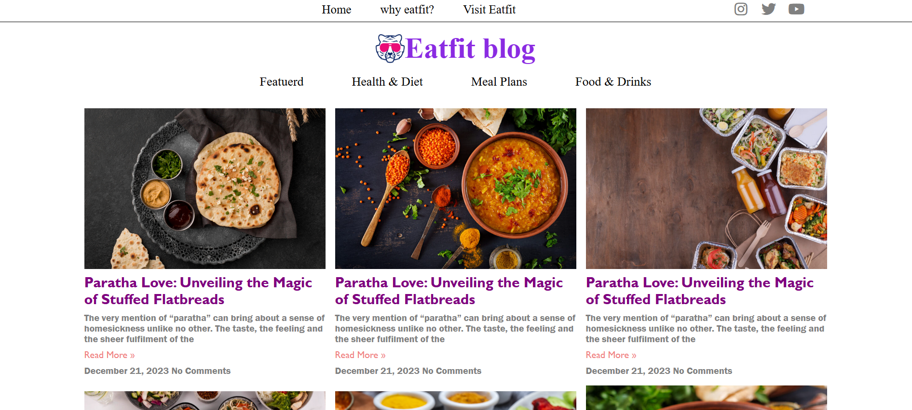

# 🍽️ EatFit Blog

A modern and responsive food blog website built using **React** and **Vite**. This project provides an attractive interface for displaying healthy food articles, recipes, and featured blog posts with reusable React components.

---

## 📖 About the Project

EatFit Blog is a frontend web application designed to showcase food-related content in a clean and visually appealing layout. It is built using React's component-based architecture and focuses on responsive design and a smooth user experience.

---

## ✨ Features

- 🍔 Responsive and modern UI
- 🧩 Reusable React components
- 📱 Mobile-friendly design
- 🎨 Clean and attractive layout
- ⚡ Fast development using Vite
- 🖥️ Organized folder structure
- 📄 Blog cards with images and descriptions
- 🧭 Navigation bar and footer

---

## 🛠️ Technologies Used

- React.js
- Vite
- JavaScript (ES6+)
- HTML5
- CSS3

---

## 📂 Project Structure

```
EatFit-Blog/
│
├── public/
│
├── src/
│   ├── assets/
│   ├── Project/
│   │   ├── Navbar/
│   │   ├── Subnavbar/
│   │   ├── Title/
│   │   ├── Cards/
│   │   └── Footer/
│   │
│   ├── App.jsx
│   ├── main.jsx
│   ├── App.css
│   └── index.css
│
├── package.json
├── package-lock.json
├── vite.config.js
└── README.md
```

---

## 🚀 Installation

### Clone the repository

```bash
git clone https://github.com/Sushmavj14/EatFit-Blog.git
```

### Navigate to the project folder

```bash
cd EatFit-Blog
```

### Install dependencies

```bash
npm install
```

### Start the development server

```bash
npm run dev
```

Open your browser and visit:

```
http://localhost:5173
```

---

## 📸 Screenshots

You can add screenshots of your project here.

Example:

```
screenshots/
    home-page.png
```

Then display it like this:

```md

```

---

## 🌱 Future Improvements

- Add search functionality
- Category-wise filtering
- User authentication
- Backend integration
- Database support
- Blog details page
- Dark mode

---

## 👩‍💻 Author

**Sushma Vajramatti**

- GitHub: https://github.com/Sushmavj14

---

## ⭐ Support

If you like this project, consider giving it a ⭐ on GitHub.

---

## 📜 License

This project is created for learning and educational purposes.